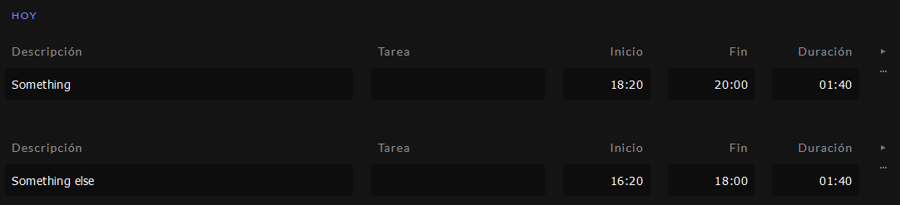
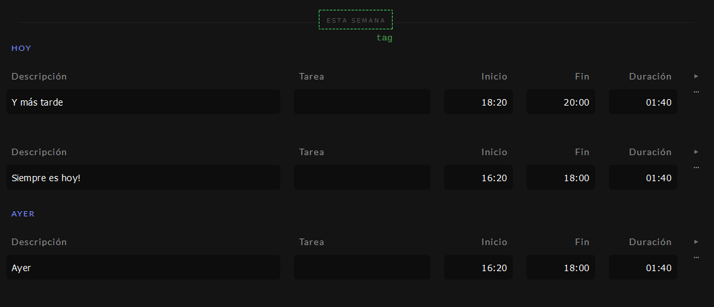

# Time tracker

**WARNING** This repo is only public because I wanted to use gh-pages. It contains experiments.

A homemade, vainilla-ts time tracking app.

I shamelessly stole almost every idea I could from **Elm** and **elm-ui**.

Development server (powered by [parcel](https://parceljs.org/)):

```bash
yarn start
```

Create a build in the /docs folder:

```bash
yarn build
```

## Icons

https://useiconic.com/open

---

Llamo `Time` a una hora con minutos. Por ejemplo, `12:34`.

Llamo `Date` a un día, sin hora. Por ejemplo, `12 jun 2014`.

Llamo `Record` a una entrada de tiempo. Tiene una fecha `Date`, una hora de comienzo `Time`,
una hora de fin `Time`, una descripción `string` y un proyecto `string`.

Llamo `TimeGroup` a un grupo de `Record`s que pertenecen al mismo día. Los
`TimeGroup` se usan para mostrar una vista:



Llamo `DateGroup` a un grupo de `TimeGroup`s dentro de un período. Por ejemplo: "la semana pasada" o "el mes pasado". Los `DateGroup` tienen un `Tag` que funciona como un identificador, y se muestran como un acordeón colapsable:


